 

I build **real-time systems, intelligent applications and modern digital experiences** — 
taking an idea from **architecture → implementation → interface → deployment**.

## Stack

 

 

## Featured work

<table>
<tr>
<td width="50%" valign="top">

### 🌐 IoT Platform
Real-time device monitoring, MQTT communication, live dashboards and dynamic alert rules.

`Node.js` `TypeScript` `MQTT` `Socket.IO` `MySQL`

</td>
<td width="50%" valign="top">

### 🤖 AI Platform
Agentic workflows and AI-assisted development tooling that changes how software gets built.

`Python` `LLM` `Agents` `Automation`

</td>
</tr>
<tr>
<td width="50%" valign="top">

### 📱 Mobile & Portfolio
Polished React Native experiences with real-time data and responsive, modern interfaces.

`React Native` `Expo` `TypeScript` `Zustand`

</td>
<td width="50%" valign="top">

### 💬 Discord Bot
Multifunction community bot — games, registration systems and automation utilities.

`JavaScript` `Discord.js`

</td>
</tr>
</table>

  

## Activity

<picture>
  <source media="(prefers-color-scheme: dark)"  srcset="https://raw.githubusercontent.com/MuizKmz/MuizKmz/output/snake-dark.svg">
  <source media="(prefers-color-scheme: light)" srcset="https://raw.githubusercontent.com/MuizKmz/MuizKmz/output/snake.svg">
  
</picture>

### Let's connect

Interested in **IoT · AI · Mobile · Full-Stack**? Say hi.

